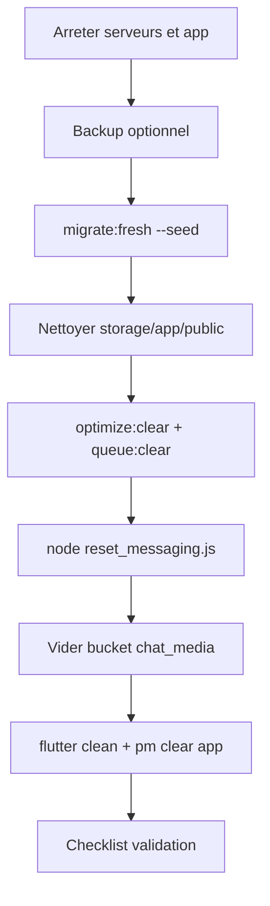

# Reset complet Togo Market — procédure sécurisée

**Objectif** : repartir comme une première installation (aucune donnée métier, aucune session), **sans toucher au code source** ni aux secrets (`.env`, credentials Firebase).

**Durée estimée** : 15–30 min selon la taille des médias.

---

## Phase 0 — Audit : où sont stockées les données ?

### A. MySQL (Laravel) — `laravel-togo-market`

| Zone | Tables / contenu | Supprimé par `migrate:fresh` ? |
|------|------------------|-------------------------------|
| Utilisateurs & auth | `users`, `personal_access_tokens`, `password_reset_tokens` | Oui |
| Boutiques & produits | `boutiques`, `produits`, `images_produit`, `boutique_category`, `category_user` | Oui |
| Commandes | `orders`, `commandes`, `lignes_commande` | Oui |
| Chat MySQL (legacy / peu utilisé si Firestore actif) | `conversations`, `messages` | Oui |
| Social | `favoris`, `notifications`, `search_histories` | Oui |
| Référentiel | `categories`, `villes`, `quartiers`, `adresses` | Oui puis **re-seed** |
| Infra Laravel | `sessions`, `cache`, `cache_locks`, `jobs`, `job_batches`, `failed_jobs` | Oui |

**Seed après reset** ([`DatabaseSeeder.php`](../../laravel-togo-market/database/seeders/DatabaseSeeder.php)) :
- `CategorySeeder` — catégories système
- `LocationSeeder` — villes / quartiers Togo  
→ **Aucun utilisateur, produit, boutique, commande.**

### B. Fichiers locaux Laravel — `storage/`

| Chemin | Contenu | Action reset |
|--------|---------|--------------|
| `storage/app/public/produits/` | Photos produits uploadées | **Supprimer fichiers** |
| `storage/app/public/boutiques/` | Logos / bannières boutiques | **Supprimer fichiers** |
| `storage/app/public/profiles/` | Avatars utilisateurs | **Supprimer fichiers** |
| `storage/app/firebase/firebase-credentials.json` | Compte de service (FCM + custom tokens) | **NE PAS SUPPRIMER** |
| `storage/logs/laravel.log` | Logs applicatifs | Optionnel : vider / archiver |
| `storage/framework/cache/` | Cache fichier (si driver file) | Vidé par `optimize:clear` |
| `storage/framework/sessions/` | Sessions fichier (si driver file) | Vidé par `optimize:clear` |

**Note** : les images catalogue **ne sont pas sur Supabase** dans le code actuel ; elles sont sous `storage/app/public/`.

### C. Firebase — projet `togo-market-fc0a7`

| Service | Données | Outil de purge |
|---------|---------|----------------|
| **Firestore** | Collection `chats` + sous-collection `messages` par chat | [`scripts/firebase_reset/reset_messaging.js`](../scripts/firebase_reset/reset_messaging.js) |
| **Firebase Storage** | Préfixe `chats/` (anciens médias si upload Firebase) | Même script |
| **FCM** | Tokens stockés dans MySQL `users.fcm_token` | Effacés par `migrate:fresh` |
| **Firebase Auth** | Comptes créés via custom token (UID = id user/boutique) | Optionnel : Console → Authentication → Users → tout supprimer |

**Realtime Database** : non utilisé dans le code actuel.

### D. Supabase — projet `mgtqeeqnmikjieljikwb` (URL dans `.env`)

| Bucket (code) | Usage | Action |
|---------------|-------|--------|
| `chat_media` | Images + vocaux du chat (`chats/{chatId}/...`) | **Vider le bucket entier** |

Aucun autre bucket n’est référencé dans le code Flutter. Les images produits/boutiques/profils **ne passent pas par Supabase** aujourd’hui.

### E. Flutter — stockage local (appareil / émulateur)

| Mécanisme | Clés / contenu | Comment effacer |
|-----------|----------------|-----------------|
| **FlutterSecureStorage** | `auth_token`, `user_data` | Désinstaller l’app ou `deleteAll()` |
| **SharedPreferences** | `is_first_time`, `recent_searches_local`, `cached_notifications_local`, `downloaded_chat_media_urls` | Désinstaller l’app |
| **CachedNetworkImage** | Cache disque des URLs réseau | Désinstaller l’app ou vider cache Android |
| **Fichiers temporaires** | Images compressées (`ImageOptimizationService`) | Désinstaller / `flutter clean` |

**Hive** : dépendance présente dans `pubspec.yaml` mais **non utilisée** dans `lib/` actuellement.

### F. Ce qui n’est PAS supprimé (volontairement)

- Code source (`lib/`, `app/`, migrations, seeders)
- `.env` / `.env.example`
- `firebase-credentials.json`
- `google-services.json` / config Firebase Android
- `vendor/`, `node_modules/`
- Règles Firebase / Supabase dans la console (configuration, pas données)

---

## Phase 1 — Backup optionnel (recommandé)

Exécuter **avant** toute suppression.

```bash
# Horodatage pour les archives
export RESET_DATE=$(date +%Y%m%d_%H%M%S)
export BACKUP_DIR="$HOME/togo_market_backups/$RESET_DATE"
mkdir -p "$BACKUP_DIR"

# 1. MySQL (adapter user/password/database depuis .env)
cd /home/othnelio/laravel-togo-market
source .env 2>/dev/null || true
mysqldump -u "${DB_USERNAME:-root}" -p"${DB_PASSWORD}" "${DB_DATABASE:-laravel_togo_market}" \
  > "$BACKUP_DIR/mysql_laravel_togo_market.sql"

# 2. Uploads Laravel
tar -czf "$BACKUP_DIR/laravel_storage_public.tar.gz" -C storage/app public

# 3. Credentials Firebase (optionnel, sensible)
cp storage/app/firebase/firebase-credentials.json "$BACKUP_DIR/" 2>/dev/null || true

# 4. Export Firestore (optionnel, nécessite firebase-tools + droits)
# firebase firestore:export "$BACKUP_DIR/firestore_export" --project togo-market-fc0a7

echo "Backups dans: $BACKUP_DIR"
```

**Supabase** : Dashboard → Storage → `chat_media` → sélectionner tout → Download (si peu de fichiers).

---

## Phase 2 — Arrêt des services

```bash
# Arrêter composer run dev (Ctrl+C dans le terminal Laravel)
# Arrêter flutter run sur le téléphone/émulateur
```

---

## Phase 3 — Reset MySQL + Laravel (ordre 1)

```bash
cd /home/othnelio/laravel-togo-market

# Confirmation interactive : efface TOUTES les tables puis re-migre + seed
php artisan migrate:fresh --seed

# Vider les uploads locaux (garder .gitignore)
find storage/app/public/produits -mindepth 1 -delete 2>/dev/null || true
find storage/app/public/boutiques -mindepth 1 -delete 2>/dev/null || true
find storage/app/public/profiles -mindepth 1 -delete 2>/dev/null || true

# Caches, sessions, queues, config
php artisan optimize:clear
php artisan queue:clear
php artisan config:clear
php artisan route:clear
php artisan view:clear

# Recréer le lien symbolique public/storage si besoin
php artisan storage:link
```

**Vérification MySQL rapide :**

```bash
php artisan tinker --execute="
echo 'users: '.\\App\\Models\\User::count().PHP_EOL;
echo 'produits: '.\\App\\Models\\Produit::count().PHP_EOL;
echo 'boutiques: '.\\App\\Models\\Boutique::count().PHP_EOL;
echo 'orders: '.\\Illuminate\\Support\\Facades\\DB::table('orders')->count().PHP_EOL;
echo 'categories: '.\\App\\Models\\Category::count().PHP_EOL;
echo 'villes: '.\\App\\Models\\Ville::count().PHP_EOL;
"
```

Attendu : `users/produits/boutiques/orders = 0`, `categories` et `villes` > 0.

---

## Phase 4 — Reset Firebase (ordre 2)

```bash
cd /home/othnelio/Togo_market/scripts/firebase_reset
npm install   # une seule fois si node_modules absent
node reset_messaging.js
```

Le script supprime :
- toute la collection Firestore `chats` (+ `messages`)
- tous les fichiers Storage sous `chats/`

**Optionnel — utilisateurs Firebase Auth** (Console) :  
[Authentication](https://console.firebase.google.com/project/togo-market-fc0a7/authentication/users) → supprimer les UID de test.

---

## Phase 5 — Reset Supabase Storage (ordre 3)

### Option A — Dashboard (simple)

1. [Supabase Dashboard](https://supabase.com/dashboard) → projet lié à `SUPABASE_URL`
2. **Storage** → bucket **`chat_media`**
3. Sélectionner tous les objets (préfixe `chats/`) → **Delete**
4. Vérifier : bucket vide

### Option B — SQL / API (bucket entier)

Si d’autres dossiers ont été ajoutés manuellement, supprimer **tous** les objets du bucket `chat_media`.

> Sans **service role key**, la clé `anon` ne peut pas tout supprimer si les policies RLS le bloquent → utiliser le Dashboard ou la clé `service_role` côté serveur uniquement.

**Créer d’autres buckets** (produits, avatars) : seulement si vous les avez ajoutés hors code ; le repo n’en utilise pas d’autre que `chat_media`.

---

## Phase 6 — Reset application Flutter (ordre 4)

```bash
cd /home/othnelio/Togo_market

flutter clean
flutter pub get
```

**Sur l’appareil Android** (package `com.example.togo_market`) :

```bash
# Efface données app + cache + secure storage + SharedPreferences
adb shell pm clear com.example.togo_market
```

Ou : Paramètres Android → Applications → Togo Market → Stockage → **Effacer les données**.

Puis réinstaller / relancer :

```bash
flutter run
```

**Effet** : plus de token Sanctum, plus de cache onboarding (`is_first_time`), plus d’historique recherche/notifications locaux.

Pour revoir l’onboarding : la clé `is_first_time` est supprimée avec `pm clear`.

---

## Phase 7 — Checklist de validation finale

Cocher chaque point après le reset.

### Backend Laravel

- [ ] `php artisan tinker` → `User::count()` === **0**
- [ ] `Produit::count()` === **0**
- [ ] `Boutique::count()` === **0**
- [ ] `DB::table('orders')->count()` === **0**
- [ ] `DB::table('favoris')->count()` === **0**
- [ ] `DB::table('search_histories')->count()` === **0**
- [ ] `DB::table('notifications')->count()` === **0**
- [ ] `Category::count()` > **0** (seed OK)
- [ ] `Ville::count()` > **0** (seed OK)
- [ ] `storage/app/public/produits` vide (ou seulement `.gitignore`)
- [ ] `storage/app/public/boutiques` vide
- [ ] `storage/app/public/profiles` vide

### Firebase

- [ ] Console Firestore → collection `chats` **vide**
- [ ] Console Storage → aucun fichier sous `chats/` (si Storage activé)
- [ ] Script `reset_messaging.js` terminé sans erreur critique

### Supabase

- [ ] Bucket `chat_media` **vide** (0 objets)

### Application Flutter

- [ ] Premier lancement → écran onboarding ou auth (pas de session auto)
- [ ] Aucune conversation dans Messages
- [ ] Aucun produit / commande / favori affiché
- [ ] Envoi image chat : échoue ou réussit sur **nouvelle** conversation uniquement (normal sans vendeur)

### Test fonctionnel minimal (post-reset)

1. Créer un **nouveau** compte utilisateur
2. Publier un produit test → image visible (nouveau fichier dans `storage/app/public/produits`)
3. Ouvrir un chat → envoyer une image → fichier visible dans Supabase `chat_media/chats/...`

---

## Ordre récapitulatif (ne pas inverser)



---

## Dépannage

| Symptôme | Cause probable |
|----------|----------------|
| Encore des produits affichés | Cache Flutter / pas `pm clear` / ancienne APK |
| Conversations visibles | Firestore non purgé ou mauvais projet Firebase |
| Images chat cassées mais anciennes URLs | Supabase `chat_media` non vidé |
| 401 sur API | Normal après reset : se reconnecter |
| Catégories vides | `migrate:fresh --seed` non exécuté ou seed en erreur |

---

## Script tout-en-un (local dev uniquement)

Un script shell optionnel est disponible : [`scripts/full_reset_local.sh`](../scripts/full_reset_local.sh).

**⚠️ Irréversible.** Lire le script avant exécution. Ne pas lancer en production sans backup.

```bash
bash /home/othnelio/Togo_market/scripts/full_reset_local.sh
```
